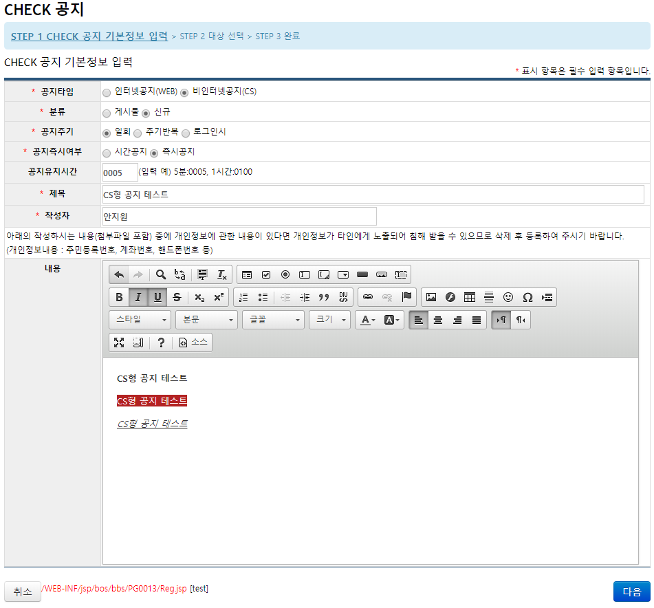
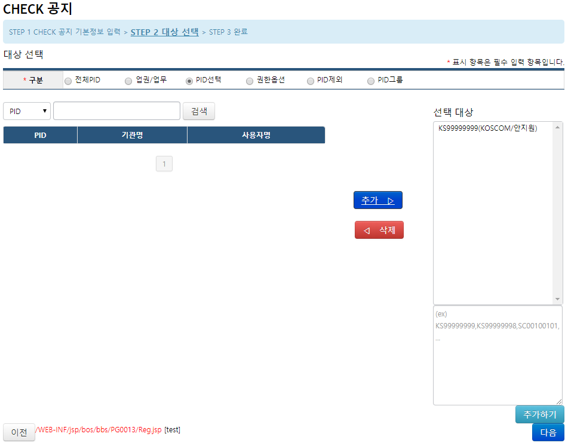
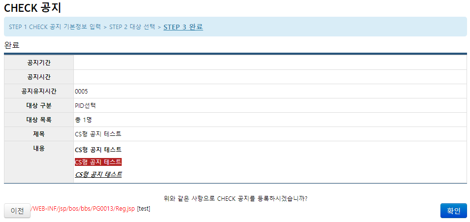

## CHECK공지

> **공지관리 - CHECK공지** 기능은 CHECK 이용객에게 '팝업' 형태의 공지를 띄우고, 관리하기 위한 기능이다.

> 기능의 동작 흐름은 다음과 같다.  

1. **CHECK공지** 게시판에 공지의 내용을 등록한다.
2. 게시글의 내용과 더불어 공지를 띄우기 위한 **기본 설정 정보** 들이 `kc_crm` 과 `hdb` 에 저장된다.
3. CHECK client 의 **공지 처리 프로그램**이 `hdb` 에 등록된 공지 정보를 바탕으로 공지 팝업을 생성한다.
4. 공지 대상으로 설정된 고객에게 공지 팝업을 띄운다.
    - 보통 PID를 기준으로 공지 대상을 설정한다.

### 등록 및 수정

1. 관리자 ID로 로그인 한 뒤 공지관리 - CHECK공지 메뉴로 이동한다.

2. '등록' 버튼을 클릭한다.

3. 필요한 항목들을 입력하고 '다음' 버튼을 클릭한다.
    - 공지타입
        - 인터넷공지(WEB)
        - 비인터넷공지(CS)
    - 분류
        - 게시물
        - 신규
    - 공지주기
        - 일회
        - 주기반복
        - 로그인시
    - 공지즉시여부
        - 시간공지
        - 즉시공지
    - 공지유지시간
    - 제목
    - 작성자
    - 내용

    

4. 공지할 대상을 설정한 뒤 '다음'을 클릭한다.
    - 전체PID
    - 업권/업무
    - PID선택
    - 권한옵션
    - PID제외
    - PID그룹

    

5. 등록 전 최종적으로 공지의 설정 정보를 확인한 뒤 '확인' 버튼을 눌러 등록한다.

    

6. 등록한 공지 팝업이 정상적으로 뜨는지 CHECK 에서 확인한다.

    