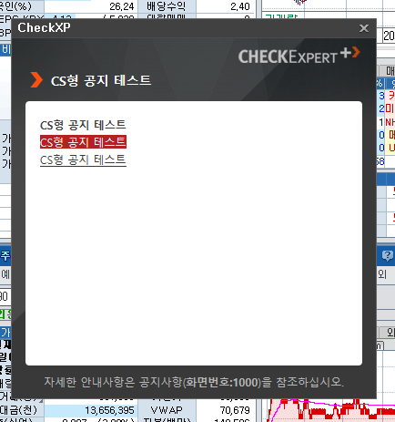

## CHECK공지

**공지관리 - CHECK공지** 기능은 CHECK를 사용 중인 고객에게 '팝업(popup)' 형태의 공지를 띄우고, 관리하기 위한 기능이다.

CS형이라 불리는 비인터넷공지와 Web형이라 불리는 인터넷공지가 있는데, 인터넷공지의 경우 인터넷이 연결되지 않는 환경에서 CHECK를 이용하는 고객들은 *볼 수 없다*.

따라서 장 시간 변경, 장애 등 중요한 내용을 공지할 때는 **CS형(텍스트 위주)** 을 주로 이용하고, 신규 화면 홍보, 설문조사 등의 부가적인 내용일 경우엔 **Web형(이미지 위주)** 공지를 주로 이용한다.

- 공지 기능의 주 이용자는 정보사업실, 정보업무팀 콘텐츠 담당 직원들이며, CS형 공지는 대체로 담당 직원이 직접 등록한다.

- Web형 공지의 경우 원하는 이미지 파일과 게시기간을 사내메일로 crm 담당자에게 전송하면 crm 담당자가 작업하여 게시해 주는 형태로 작업한다.

- 현재 Web형 공지는 BICNS 에서 전담하여 처리하고 있으므로 요청이 오면 확인 후 전달한다.


팝업은 보통 CHECK 실행시 바로 뜨는데, (특히 Web형 공지에서) 엑박이 뜨는 등 정상적으로 로드되지 않으면 CHECK 고객 입장에서는 **<u>CHECK 품질 자체가 떨어지는 것으로 인식</u>** 하게 된다. 팝업 자체를 띄우는 것은 간단한 작업이지만 신경 써서 작업하고 정상적으로 뜨는지 여부도 항상 확인하는 것이 좋다.

종종 팝업에 입력폼이 있어도 응답할 수 없다고 연락이 오는 경우가 있는데, 대체로는 **IE10 이하의 구버전 브라우저** 를 쓰고 있는 것이 원인인 경우가 많다. 이런 고객은 IE11 이상으로 업그레이드 할 것을 권장한다.

---

### 기능의 동작 흐름은 다음과 같다.  

1. **CHECK공지** 게시판에 공지의 내용을 등록한다.

2. 게시글의 내용과 더불어 공지를 띄우기 위한 **기본 설정 정보** 들이 `kc_crm` 과 `hdb` 에 저장된다.

3. CHECK client 의 **공지 처리 프로그램**이 `hdb` 에 등록된 공지 정보를 바탕으로 공지 팝업을 생성한다.

4. 공지 대상으로 설정된 고객에게 공지 팝업을 띄운다.
    - 보통 PID를 기준으로 공지 대상을 설정한다.

---

### 등록 및 수정 방법은 다음과 같다.

1. 관리자 ID로 로그인 한 뒤 **공지관리 - CHECK공지** 메뉴로 이동한다.

2. '등록' 버튼을 클릭한다.

3. 필요한 항목들을 입력하고 '다음' 버튼을 클릭한다.
    - 공지타입
        - 인터넷공지(WEB)
        - 비인터넷공지(CS)
    - 분류
        - 게시물
        - 신규
    - 공지주기
        - 일회
        - 주기반복
        - 로그인시
    - 공지즉시여부
        - 시간공지
        - 즉시공지
    - 공지유지시간
    - 제목
    - 작성자
    - 내용

    

4. 공지할 대상을 설정한 뒤 '다음'을 클릭한다.
    - 전체PID
    - 업권/업무
    - PID선택
    - 권한옵션
    - PID제외
    - PID그룹

    


5. 등록 전 최종적으로 공지의 설정 정보를 확인한 뒤 '확인' 버튼을 눌러 등록한다.

    

6. 등록한 공지 팝업이 정상적으로 뜨는지 CHECK 에서 확인한다.

    

---

### 연관 소스코드의 위치는 다음과 같다.


### Web형 공지
- 컨트롤러(java): `PollPopupController.java`
    ```
    @RequestMapping("/bos/crm/ext/kscNtc_{popupName}.do")
    public String popupEventControl(ZValueParam zparam, ModelMap model, @PathVariable("popupName") String popupName) throws Exception
    {
        ...
        return "/portal/event/promotion/" + popupName;
    }
    ```
    > 팝업의 좀 더 빠른 처리를 위해 `kscNtc_*` 로 들어오는 request는 https가 아닌 **http** 로 처리되도록 서버에 예외 설정 되어 있다.  
    

    > 기본적인 Web형 공지는 이미지만 잘 띄워주면 되므로 대체로 서비스나 DAO가 필요하지 않다.

    > 만일 입력값을 받아서 저장해야 하는 등 이미지 표시 외에 추가 기능이 필요할 경우엔 같은 컨트롤러 안에 다른 request 로 정의되어 있을 가능성이 크므로 해당 내용을 찾아본다.


- 화면(jsp): `/WEB-INF/jsp/portal/event/promotion/YYYYMMDD.jsp`
    * 보통은 해당 팝업이 뜨기 시작하는 날짜를 jsp 이름으로 생성한다.

### CS형 공지