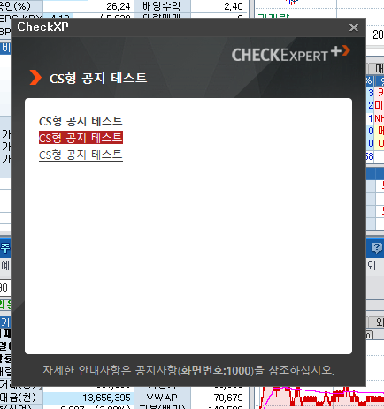

# CHECK CRM 개요

> CHECK crm은 CHECK를 이용하는 *고객에 대한 각종 정보* 뿐만 아니라, CHECK 서비스 자체의 운영을 위해 필요한 주요 정보들에 접근하여 관리하기도 하는 *종합 운영 관리* 웹 어플리케이션이다.

> MySQL의 *kc_crm* db뿐만 아니라 정보시스템의 *증권종합db(hdb)*, *상품db(xdb)* 데이터 등과도 밀접한 관계를 가지고 있으므로 작업시 *데이터 간 연관 관계*에 대한 이해와 세심한 처리가 필요하다.

> 코스콤의 영업, 콘텐츠, 시스템 업무 관련 직원들을 비롯하여 협력업체의 리서치, 출장소 업무 담당 직원들까지 CHECK crm의 *내부 고객*이며, 요청사항에 응대해야 한다.

> 최근 1년여 사이 CHECK 고객 정보에 대한 *자동화, 시스템화* 요구가 높아지면서 crm에서 관리해야 할 정보와 기능 역시 다양화되었으며, 관련된 요구가 지속적으로 존재한다.

구체적으로 crm에서 다루고 있는 정보 및 기능들은 다음과 같다.

- CHECK를 이용하는 고객들과 직/간접적으로 연관되어 있는 모든 정보 관리
    - 이름, 회사, 주소, 연락처 등의 기본 정보
    - 요구사항 및 관련 처리 사항 등의 고객 요청 내용 관리
    - 모바일CHECK 접속 허용 관리
    - 각종 사용 log 분석, 통계

- CHECK에서 제공 중인 정보 이용을 위한 고객별 **권한** 관리
    
    > 접속 파트와 연계되어 있으며, hdb 데이터와의 동기화는 필수  

    > 과금과 연계되며, 오류 발생시 고객에 불편을 초래하는 민감한 부분이므로 **취급 시 주의**

- CHECK에서 제공되는 **web형 화면(팝업, 게시판)** 에 대한 설정 및 관리
    - CHECK를 통해 띄우는 팝업형 *'공지'* 관리 (공지관리 메뉴)
    - CHECK를 통해 띄우는 팝업형 *'설문조사'* 관리 (공지관리 메뉴 및 화면#2710)
    - CHECK에서 조회 가능한 고객용 *'게시판'* 관리 (화면#1000)

- 그 외 crm을 통해 CHECK 고객 정보에 접근 가능한 직원들의 정보 관리
    - 사내외 접속 허용, 고객 정보 변경 이력 관리 등


## 메뉴 구성

- 고객정보
    - 신규등록
        > 신규 고객이 CHECK를 이용하기 위해선 'PID'를 발급 받아야 하며, 이 PID를 발급하기 위한 작업은 crm의 '신규등록' 기능을 통해 수행한다.
        
        > 주로 정보사업실의 영업 업무 담당 직원들이 수행한다.

    - 고객정보관리
        - 고객정보관리

            > 등록된 전체 PID 및 이와 관련된 각종 정보 항목들을 조회하고 관리한다.

        - 옵션만료고객조회

            > 권한옵션의 만료가 얼마 남지 않은 PID들에 대해 조회한다.

        - 옵션일괄변경(Admin)

            > 권한옵션 정보를 대량으로 변경하여 적용할 필요가 있을 때 이용한다.

            > 일반 직원에겐 비공개되어 있으며, 대량 일괄 변경의 요청이 있을 때 관리자가 직접 이 기능을 통해 작업한 후 결과를 통보한다.

    - 기관및담당자관리
        > 등록된 모든 고객사(기관) 및 그 고객사들의 영업/리서치 담당자 정보를 관리한다.
        
    - 사용자관리
        > 등록된 모든 PID에 대해 실제로 그 PID를 사용하는 '사용자'에 대한 정보를 관리한다.

        > 보통 PID 1개당 1명의 사용자가 연결된다.

    - **고객자료관리**
        > 과거 업무영역별로 각기 관리되어 오던 고객과의 상담자료들을 시스템 상에서 통합 관리하기 위해 2018년 말~2019년 초에 새로 만들어진 기능으로, crm 내에서 활용도가 높은 기능 중 하나이다.

        > 최초 개발 시 엑셀로 관리되던 데이터들을 모두 db에 migration 하는 작업을 수행하였으며, 그 이후엔 모든 관련 업무담당자들이 crm에 자료를 작성하고 있다.  
            - 이 엑셀 데이터 작업을 위해 만들었던 *Migration(Admin)* 메뉴가 남아있으나, 현재는 쓰지 않는다.

        > 직접 입력 외에도 xdb 등 db에 존재하는 데이터를 매일 kc_crm으로 가져오는 반복 작업의 수행을 통해 지속적으로 데이터를 추가, 관리한다.  

        - 목록 및 조회
        - 신규 입력
        - Migration(Admin)
            > 기능 최초 오픈시 과거 엑셀로 관리하던 데이터들을 마이그레이션 하기 위해 이용했던 기능으로, 현재는 필요하지 않다. 삭제 가능.

    - **요구사항처리**
        > CHECK **#9050, #9051**(요구사항, 요구사항 상세) 화면과 동일한 데이터를 관리할 목적으로 만들어진 기능이다.  

        > 고객의 요구사항에 대한 처리 내용 및 진행 상황을 관리하기 위한 목적으로 활용되고 있다.

        > 2018년에 최초 개발이 완료된 이후 crm 쪽에는 추가 변경 요구가 없었으나 적절히 지속적으로 사용되고 있는 것으로 보인다.  


- 모바일관리
    > 모바일CHECK를 사용하는 고객의 접속 정보 관리를 위해 사용되는 메뉴이다.  

    > 모바일CHECK 사용을 원하는 고객은 CHECK 화면#9029 를 통해 신청할 수 있다.

    > #9029 화면을 통해 들어온 사용요청 또는 해지요청에 대한 처리를 이 메뉴 내에서 제공하는 기능들을 통해 할 수 있다.

    - 서비스관리
        > 전체 사용자 목록을 조회할 수 있고, 요청 처리, 비밀번호 초기화 등의 부가 기능을 수행할 수 있다.
    - 현재 접속자
        > 현재 모바일CHECK를 사용 중인 고객 목록을 조회한다.
    - 일별 접속자
        > 일별 모바일CHECK 접속자수 현황을 조회한다.
    - 문자 알림 관리
        - SMS 수동 발송
            > 모바일CHECK 사용, 해지요청이 처리되면 자동으로 문자가 발송되는데, 해당 기능을 이용하여 수동으로도 문자를 보낼 수 있게 만들어 놓은 기능이다.

        - 결과 목록
            > 이제까지 발송된 문자 목록을 조회한다.

    > (기타사항)  
    관련 데이터는 hdb의 `CUST_MOBILE_MAST` 테이블에만 존재한다.  
    주 이용자는 정보업무팀 홍석진 과장이다.  
    기능 개선 및 변경에 대한 요구는 최근 1년 이상 없었다...


- 공지관리
    > 공지 데이터는 kc_crm과 hdb(또는 xdb) _**양쪽 모두에서 관리**_ 되므로 주의를 요한다.  
        - crm에서 작성된 데이터는 `kc_crm.TB_BBS_ESTN` 에 저장되고,  
        - CHECK에서 디스플레이 하기 위해 사용되는 데이터는 hdb의 `CUST_NOTICE_MAST`, xdb의 `CRM_CUST_POSTIT_MAST` 등에 저장된다.        

    - CHECK공지
        > CHECK 사용자에게 팝업형 공지를 띄울 때 이용한다.

        > CS형(비인터넷) 팝업공지와 인터넷형 팝업공지가 있다.

        > CS형 팝업은 아래 이미지와 같이 뜬다.

        

        > 게시판에 등록하듯 관련 정보를 입력하여 등록하면 정해진 시간대에 정해진 고객에게 팝업 공지를 보여준다.

        > CHECK공지 등록 및 관리와 관련된 더 자세한 내용은 **`CHECK공지_관리/README.md`** 를 참고한다.

    - 원격명령
        > 사용하지 않는 것 같다. 관련 개선 요구가 초창기 이후 거의 없었다.

    - 팝업관리
        > 현재 등록되어 있는 모든 팝업 공지의 목록과 상태를 조회할 수 있다.

        > 게시판 형으로 관리되는 'CHECK공지' 와는 다르게 실제로 hdb에 등록되어 있는 데이터를 기반으로 보여준다.

    - CHECK포스트잇
        > CHECK의 특정화면에 '포스트잇'으로 표시되는 부가설명을 첨가하는 기능이다. 텍스트 스타일 적용을 위해 rtf(Rich Text Format) 형식에 의해 작성된 본문을 저장해야 하지만 crm에서는 해당 포맷의 글을 바로 작성할 수가 없다. 따라서 외부에서 작성한 뒤 복붙하는 방식을 사용한다.

        > 내용이 마치 깨진 문자열처럼 보이는 것은 rtf 형식이 적용되어 있기 때문이다.

        > 최초 개발 시 CHECK공지와 같이 게시판 형식을 따서 개발하였으며, 기능 오픈 이후 특별한 개선 요청은 없으나 지속적으로 사용 중인 것으로 보인다.

- 설문조사
    > CHECK에서는 여러가지 주제로 고객들을 대상으로 설문조사를 진행하곤 한다.  
    > 이러한 설문조사는 보통 인터넷공지 스타일로 띄워지며, 고객의 응답 결과는 '설문조사' 메뉴에서 조회할 수 있도록 관리자용 메뉴로 추가된다.

    > 설문조사의 응답폼 제작, 공지, 고객 응답결과 저장, 조회 등 관련된 일련의 작업들은 현재 **협력업체(BICNS)** 에서 담당하고 있다. 작업의뢰, 문제 발생시 해결 요청은 협력업체에 하는 것이 가장 빠르다.

    > 응답 데이터는 kc_crm의 `CRM_POLL_BASE_COMMENT`, xdb의 `CRM_POLL_BASE_RATE` 등에 혼재되어 저장되므로 변경에 주의를 요한다.  
        - xdb에 데이터를 저장하는 이유는 CHECK **화면#2710** 에서 금리설문조사 응답 결과를 조회하기 위해서이다.

    - 지난설문
        - 체크오픈기념(160425)
        - 채권4사평가(161114)
            > 위 두 설문은 날짜에서 알 수 있듯 과거 오래전에 시행되었던 설문이며 그 결과값만 유지하고 있는 상태이다.

        - 신년금융캘린더(2019)
            > 최근에 금융캘린더를 받아간 고객 응답 자료인 듯 하다.
        - 새해자본시장전망(2019)
            > 최근 시행한 일회성 설문조사 결과 자료이다.
    - FOMC금리POLL
    - 한국은행금리POLL
        > FOMC금리POLL과 한국은행금리POLL은 매달 금리위원회의 발표가 있기 전에 _반복적으로_ 수행된다.  
        > 위 두 메뉴에서 그 반복된 설문들에 대한 고객의 응답 결과를 조회할 수 있다.
    - 경품수령자
        > 금리설문에 성실하게 응답한 사용자 중 일부는 '당첨'되어, 2만원 상당의 경품을 지급받을 수 있으며, 이를 위한 개인정보 입력 요청을 받는다. (이 또한 팝업 공지로 수행) 이 응답 결과들을 조회할 수 있다.

    - 고객의견
        > 각종 설문조사 시에 고객이 입력한 의견 정보를 모아서 조회할 수 있다.

    - 설문조사 당첨자 정보
        > 2019년 2월, 설문 경품 당첨자로부터 입력받는 항목이 변경되면서 새로 생긴 것으로 보인다...  
        > '경품수령자'는 구 버전, 이 메뉴는 신 버전인 것 같은데 상세 내용은 협력업체에 문의를...


- 게시판
    > 게시판 메뉴는 CHECK **#1000** 화면과 연계되어 있다.

    - 공지사항
        > #1000 화면의 '공지사항' 게시판에 표시될 내용을 게시한다.

        > 게시판의 기본 기능 외에 부가적인 기능은 거의 사용하지 않는 단순한 형태이다.

    - 교육관리
        > #1000 화면에서의 '초청교육', '방문교육'과 관련된 교육 컨텐츠를 관리한다.

        > 연관 테이블은 kc_crm db에만 존재한다.
        ```
            TN_EDU_*
        ```

        > 2018년 정도까진 정보업무팀 **허자은 과장** 이 담당자였다. 현재도 변동 없을 듯.

        - 교육안내
            > 앞으로 진행될 CHEKC 관련 교육 정보에 대해 게시한다. 기본적인 게시판이다.

        - 고객초청교육
            > '교육안내'에서 안내된 교육의 참가 신청자 명단을 확인할 수 있다.  
            > CHECK 고객들이 #1000 화면의 '초청교육' 화면을 통해 신청하면, crm 에서 그 명단을 확인하고 참석 허용 등의 작업을 할 수 있다.

        - 고객초청교육과정관리
            > #1000 화면에서 '초청교육' - '교육신청' 페이지로 들어갔을 때 표시되는 '과정명'을 관리한다.  
            > '접수마감유무'가 체크된 과정은 '과정명' 목록에서 제외된다.

        - 고객방문교육
            > #1000 화면에서 '방문교육' 페이지를 통해 방문 교육을 신청한 고객의 목록을 관리한다.

    - 구인구직
        > #1000 화면의 '구인구직' 게시판에 표시될 내용을 게시한다.  
        > '구인구직' 게시판에는 CHECK 고객도 직접 게시글 등록이 가능하며, 이에 대해 관리자가 수정 또는 삭제할 필요가 있을 땐 crm에서 작업할 수 있다.

    - 고객용(화면#1000)
        > #1000 화면에 실제로 표시되는 결과를 crm에서 바로 확인하고자 할 때 사용한다.  
        > 상단 메뉴 중 '문의'와 '설문조사' 메뉴는 사용되지 않는다.


    - CHECK다운로드
        > BICNS에서 개발한 기능. CHEKC홈페이지(www.check.co.kr)나 그 어딘가에서 다운로드 받는 파일들을 관리하는 듯 하다. 상세 내용은 BICNS 쪽에 문의...

- 통계정보
    - 화면통계
    - 기능통계
    - 종목통계
    - 뉴스원통계
    - 고객통계
    - 월간통계
    - System(접속)
    - 지수구성종목통계

- 관리자기능
    - 담당자관리
    - 코드관리
    - 게시판관리
    - 메뉴관리
    - 콜수신관리
    - HDB조회:데이터
    - HDB조회:마스터
    - 마이그레이션/동기화
    - 테스트보드
    - 주기작업

- MyPage
    - 내 정보

- 기타
    - 고객 콜상담
        > 원래는 콜중계서버를 통해 수신된 전화에 대한 상담 정보를 즉각적으로 관리하면서 동시에 기존의 전화상담 이력들과 연계하여 조회하고 관리하는 것이 목적이었으나,

        > 현재는 사용되지 않는다.

    - Auto (체크박스)
        > 체크되어 있을 경우 전화 수신 시 팝업이 뜨도록 되어 있으나, 콜중계서버 관리가 미비해 지면서 현재는 팝업이 잘 안뜨는 직원이 더 많아졌다.


----


### 주기적으로 반복해서 써야 할 기능 만들기

### 임시로 한 번만 쓰고 말 기능 만들어서 쓰기

### 관련된 소스를 찾으려면?
게시판
그 외

### 특정 사용자 외부 접속 허용/차단

### 권한옵션을 추가/변경/삭제

### 이미지를 바탕으로 한 인터넷공지 CHECK 팝업

### 주기 반복 작업
주기 반복 작업의 종류
crm 접속기록 점검일지 작성

기능 개발 방법
반복 작업 등록 방법


CHECK 고객 - 팝업이 정상 동작하지 않음
IE10을 사용하는 고객이라면 IE11 이상으로 업그레이드 해볼 것
