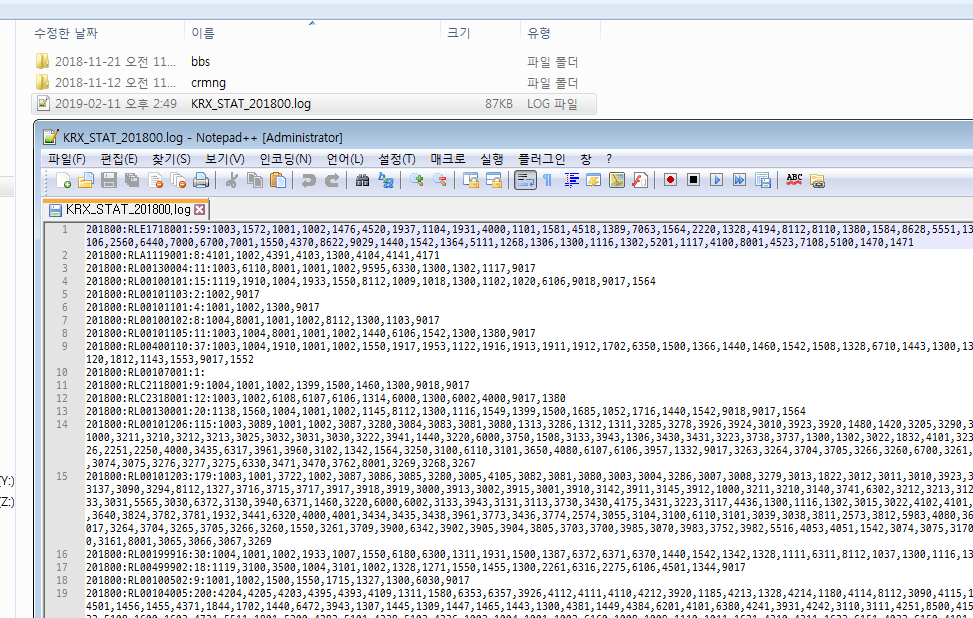
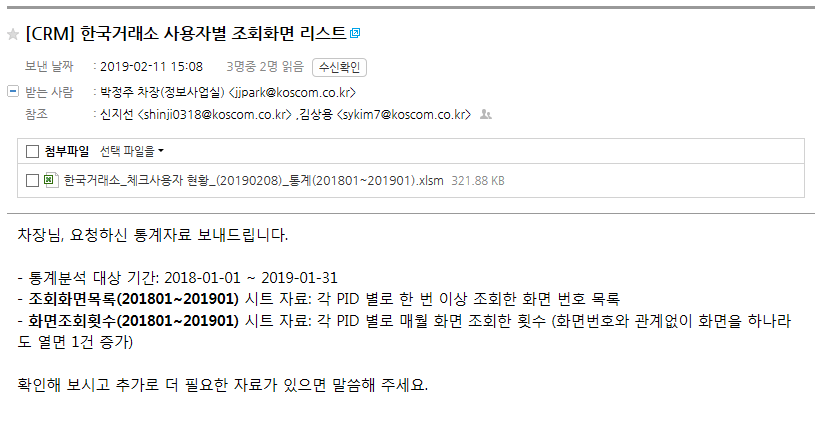
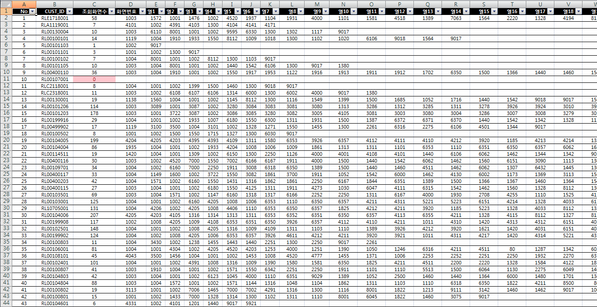
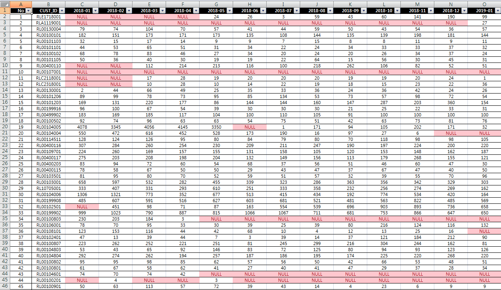
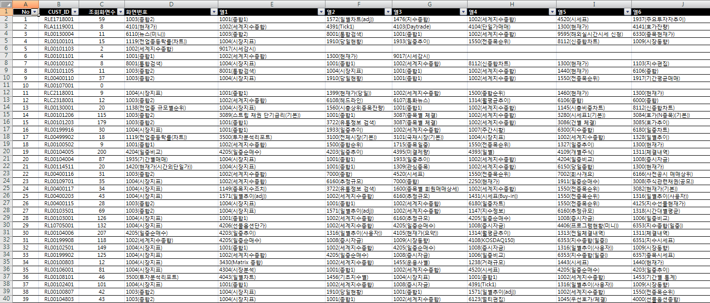

# 사용자 정의 통계 / 사용 데이터 분석

### 작업의 특징

- CRM 에서 기본적으로 제공하고 있는 통계 외에, 내부 사용자의 요구에 의한 특수한 통계 결과를 추출하거나 고객의 사용 데이터를 분석해야 할 때가 있다.
	- 특정 고객이 요청했을 때, 감사(audit) 기간에, 권한 옵션 사용 현황 분석할 때 등
-  보통은 다음과 같은 내용을 분석한다.
	- `특정 고객들이 특정 화면을 조회하거나 조회하지 않았는지`  
	&rarr; CUST_SCR_INFO @HDB
	- `특정 고객들이 특정 기능을 사용하였는지`  
	&rarr; CUST_TR_INFO @HDB
	- `특정 권한을 가지고 있는 고객들이 얼마나 있는지`  
	&rarr; TN_GOODS_OPTIONS @MySQL
	- `특정 권한을 가진 고객들이 실제로 특정 화면들을 이용하였는지`  
	&rarr; CUST_OPTIONA_MAST, CUST_SCR_INFO @HDB 연계분석
	- 등등 종류는 다양하다.

- 보통 CUST_SCR_INFO @HDB 테이블에 쌓이는 로그의 양은 무척 많기 때문에 (약 1,200,000여 건 / 1개월) __장 중에 HDB 에서 직접 과중한 분석 쿼리를 실행하는 것은 지양한다.__
	- 추천하는 방법은, 상황실에서 운영HDB 에 접속하여, 단순한 조건이 걸린 select 쿼리로 raw data를 추출한 뒤, 개발MySQL에 import 하여 분석 결과를 추출하는 것이다.
	

## 한국거래소 고객 통계

### 작업 개요
- 요청일: 2019-02-08
- 한국거래소에서 사용 중인 130여개의 PID에 대해, 지난 1년 간(2018-01-01 부터 최근까지) 각 PID들이 조회한 화면의 목록을 추출해 달라는 요청이다.

### 요청 원문
```
요청자: 박정주

한국거래소에서  이번에 대규모 인사이동과 관련하여
체크사용자 전체에 대하여
사용자별 조회화면리스트(2018년 치)를 
요청해왔습니다.
(아마도 사용빈도가 낮다고 판단되면 해지할 경우가 있으니, 최대한 자료가 많이 나오면 좋을듯합니다.)

한국거래소 체크 사용자 현황자료를 첨부하여 드리오니,
참조하시어 , 관련 자료를 만들어 주시길 요청드립니다.

자세한 사항은 정보사업실 박정주 차장에게 문의 부탁드립니다.

감사합니다.
```

### 작업 내용
1. 운영HDB로부터 2018년의 화면 조회 데이터를 가져온다.
	- 상황실 - 접속 파트 운영 단말 - DAC(샤크라) 로그인 - Orange 실행 - RCU01 @HDB 접속 - CUST_SCR_INFO 에서 로그 데이터 선택 (한 달 단위로 12번 실행할 예정)
		```
		select * from CUST_SCR_INFO where OPEN_DT 20180101 and 20180131
		```
	- 추출된 결과가 매우 많아 100건만 Orange UI 상에 보여진다. 결과 표시 화면에서 <kbd>ctrl + PageDown</kbd> 을 눌러 전체 데이터를 다시 추출한다.
	- 추출 결과를 전체 선택한 뒤 마우스 우클릭하여 엑셀 파일로 저장한다.  
	(데이터에 , 등이 포함되지 않아 파싱하기 좋은 데이터일 경우, csv로 저장하면 편리하다.)
	- 이런 식으로 2018년 매월에 대해 쿼리를 수행하여 각각의 데이터를 엑셀 파일로 저장한다.
2. Local 개발환경에서 작업할 수 있도록 엑셀로 저장한 파일들을 __망간 전송__ 또는 __공유 서버로 전송__ 한다.
	- 망간 전송은 데이터 크기에 따라 불가능할 수도 있다.
	- 접속 파트 운영 단말에서는 __접속 개발서버__ 로 ftp 전송이 가능하다.
	- <kbd>ctrl + r</kbd> &rarr; cmd &rarr; /enter/
		```
		c:\> ftp 10.150.11.10
		10.150.11.10에 연결되었습니다.
		220 (vsFTPd 2.2.2)
		사용자(10.150.11.10:(none)): tsmaster
		31 Please specify the password.
		암호: koscom123!
		230 Login successful.
		ftp> bin
		200 Switching to Binary mode.
		ftp> hash
		해시 표시 인쇄 켜기  ftp: (2048바이트/해시 표시) .
		ftp> prompt
		대화형 모드 끄기 .
		ftp> put [filename]
		#####....
		```

접속 정보 | ... |
---- | ---- |
IP | 10.150.11.10 |
username | tsmaster |
password | koscom123! |
Default path | /run/tsmaster |

3. Local 개발환경에서 개발MySQL로 로그 데이터를 import 한다.
	- Toad의 import 기능을 이용한다.
	- 이번 작업을 위해 `CUST_SCR_INFO` 라는 신규 테이블을 생성하여 모든 로그 데이터를 해당 테이블에 올렸다.

4. 요청에 적합한 쿼리를 작성하여 개발MySQL에 있는 데이터의 결과를 추출하고, 정리한다.
	- 이번 요청은 `아예 한 번도 화면을 보지 않은 PID`, 즉 CUST_SCR_INFO 로그가 존재하지 않는 PID도 있을 가능성이 있다.
	- 또한 요청 받은 자료의 엑셀에 표시된 PID의 순서를 맞춰서 파악하는 것이 중요하다.
	- 따라서 `CUST_ID_LIST`란 테이블을 만들어 요청엑셀의 PID 순서대로 업로드 한 뒤 <kbd>left outer join</kbd>을 이용하여 CUST_SCR_INFO 데이터가 없는 경우에도 대응한다.
	- 원하는 대로 결과를 생성하기 위해 (수십개에 달하는 PID별 조회 화면번호를 일렬로 정렬) koscom_crm 프로젝트에서 TempFunctionTest.java 에 간단한 JUnit 테스트 함수를 만들어 실행하였다.
		- JUnit 실행 단축키: <kbd>alt + shift + x, t</kbd>
	- 결과를 <kbd>writeLog</kbd> 함수를 통해 파일에 쓰도록 한 뒤, 각 월별 결과 파일을 엑셀에 정리하였다.
	- 자세한 내용은 <kbd>TempFunctionTest.java</kbd>의 <kbd>`TempFunction35()`</kbd>를 참고한다.
	```
	@Test
	//20180211 한국거래소 소속 PID 조회 화면 통계
	public void tempFunction35() {
	try {
			String monthParam = "201800";
			List<ZValue> resultList = dao.getListTempFunc35();
			Map<String, HashMap<String, String>> resultMap = new HashMap<String, HashMap<String, String>>();
			for(ZValue r : resultList) {
				String custId = r.getString("custId");
				if(resultMap.get(custId) == null) {
					resultMap.put(custId, new HashMap<String, String>());
				}
				resultMap.get(custId).put(r.getString("screenNo"), r.getString("count"));
			}
			
			List<ZValue> custIdList = dao.getCustIdListTempFunc35();
			for(ZValue c : custIdList) {
				String key = c.getString("custId");
				System.out.println(key + ":" + resultMap.get(key).toString());
				
				Iterator<String> iter2 = resultMap.get(key).keySet().iterator();
				String data = "";
				while(iter2.hasNext()) {
					String key2 = iter2.next();
					data += key2 + ","; // + resultMap.get(key).get(key2) + ",";
				}
				writeLog("KRX_STAT_", monthParam, key + ":" + resultMap.get(key).size() + ":" + data, null);
			}
	} catch (Exception e) {
		e.printStackTrace();
	}
	}
	```
5. 결과 파일은 <kbd>writeLog</kbd> 함수를 통해 생성된다. 결과값을 엑셀에 정리하여 요청자에게 전송하면 작업은 완료된다.
	- 파일명은 "KRX_STAT_"으로 시작하는 것을 알 수 있다.
	- 파일이 생성되는 경로는 `globals.properties` 파일의 <kbd>Globals.fileStorePath</kbd> 속성에 지정된 값을 따른다.
	(예시)
	```
	...
	# 업로드경로
	Globals.fileStorePath = D:/eGovFrameDev/files
	...
	```
	
6. 답장 및 전달한 결과 파일의 형태는 아래와 같다.





7. [추가 요청] 화면번호에 `화면명` 정보를 추가해 달라는 요청이 있었다.
- CHECK 화면번호에 대한 화면명 정보는 일단 `증권종합DB - RCT01 계정(개발은 DCT01) - CHECK_MENU` 테이블에서 찾을 수 있다.
- 이 `CHECK_MENU` 정보는 CRM의 통계정보 중 `화면통계`의 `대상화면` 정보를 표시할 때 이용하는 데이터지만, 이런 사용자가 요청한 통계 자료 작성시에도 활용할 수 있다.
- 증권종합DB의 `CHECK_MENU` 테이블은 자동으로 갱신되지 않는다. 최신정보로 업데이트 할 필요가 있으면, **클라이언트 담당자**에게 요청하여 최신 데이터를 받은 후, 이를 직접 _수작업으로 업로드_ 해야 한다.
  - 이번 작업을 위해 <u>정보업무팀 최대한 사원</u>에게 최신 데이터를 요청하였다.
- 이번 작업은 로그를 MySQL DB로 옮겨온 후 작업하였으므로, CHECK_MENU 테이블 역시 MySQL에 복제 생성하여 이용한다. 4.에서 이용했던 임시 함수 TempFunction35()는 아래와 같이 변경된다.
	- TempFunctionTest.java 변경 _`실제 변경내용은 소스코드 참조`_
	```
	@Test
	public void tempFunction35() {
		... 
	}
	```

	- TempFunction_SQL_mysql.xml 변경
	```
	<select id="getListTempFunc35" resultType="ZValue">
		select t1.CUST_ID, t2.SCREEN_NO, t2.COUNT, t3.MENU_NAME
		from CUST_ID_LIST t1 left outer join (
			...
		) t2 on t1.CUST_ID=t2.CUST_ID
		left outer join CHECK_MENU t3 on t2.SCREEN_NO=t3.TR_CODE
	</select>
	```

8. `화면명` 정보가 추가된 데이터를 다시 정리한 결과물은 아래와 같다.




### End of Doc.