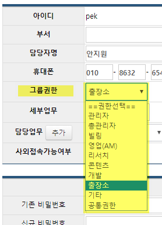
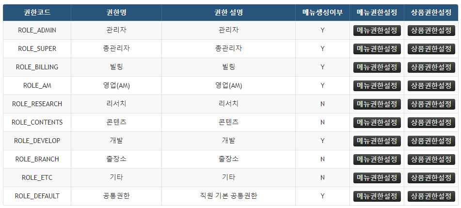
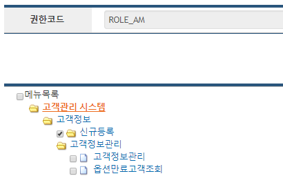
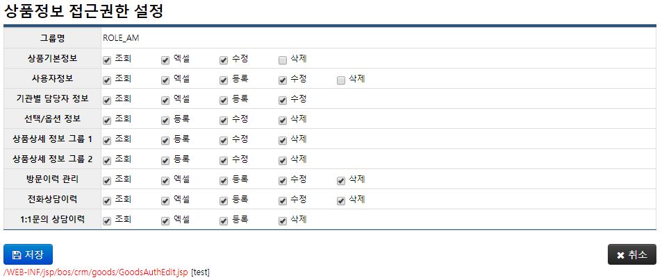

## crm 이용자의 정보 접근 권한 관리

crm 을 통해서 CHECK 상품 및 고객과 관련된 다양한 정보를 관리할 수 있지만, *모든 crm 이용자*가 *모든 crm 내 정보*에 대해서 그러한 권한을 가지는 것은 **아니다**.

crm 에는 이용자의 **'담당 업무'** 영역에 따라 정보 접근 권한을 설정할 수 있는 기능이 있다.

> *(예) '영업(AM)' 업무 권한을 가진 crm 이용자만이 '고객정보 - 신규등록' 메뉴에 접근할 수 있다.*

> *(또다른 예) '관리자' 업무 권한을 가진 crm 이용자만이 '관리자기능' 메뉴에 접근할 수 있다.*


이 권한 관리 기능을 활용하기 위해서는 아래와 같이 설정한다.

1. crm 이용자별로 '담당 업무'를 지정하여 저장한다.
    > *(예) ID: 21246 에게는 '출장소' 권한을 주고, ID: test 에게는 '관리자' 권한을 준다.*

2. 소속된 '담당 업무'별로 메뉴 또는 정보에 대한 접근 권한을 설정해 놓는다.
    - '메뉴별' 접근 권한 관리
        > *(예) '출장소' 권한 보유자에게는 '신규등록' 메뉴 접근 권한을 주지 않는다.*

    - '정보별' 접근 권한 관리
        > *(예) '영업(AM)' 권한 보유자에게는 '상품정보'에 대한 '삭제' 권한을 주지 않는다.*

---

### 이용자별 '담당 업무' 설정하기

1. **관리자기능 - 담당자관리 - 담당자 정보관리**
2. 아이디 값에 걸린 링크 클릭
3. '수정' 버튼 클릭
4. '**그룹권한**' 변경 선택 후 저장  
    

권한명 | 내용 | 비고 | 
--- | --- | ---
관리자, 총관리자 | crm 운영자에게 부여, 전체 정보 접근 가능 | 운영자, 정보보호쪽 테스트
빌링 | 과금 정보 관리 | **Bxxxxxx** 사번
영업(AM) | 고객 정보 생성 관리 | 정보사업실
리서치 | 각종 고객 요청사항 처리 | **Bxxxxxx** 사번
콘텐츠 | CHECK 제공용 화면 등 관리 | 정보업무팀
개발 | crm 직접 이용자는 아니나 crm에 접속하여 조회 필요시 | 정보서비스팀
출장소 | 각종 고객 요청사항 처리 | **6xxxx** 사번
기타 | 활용 낮음 | 
공통권한 | 공용 권한 | 

---

### '담당 업무'별 메뉴 접근 권한 설정하기

1. **관리자기능 - 담당자관리 - 그룹 권한관리** 메뉴로 이동  

    
    
2. 설정을 변경하고자 하는 권한의 '**메뉴권한설정**' 버튼 클릭  
    - 접근 권한을 부여하고자 하는 메뉴가 체크되도록 한 후 저장한다.
    - (예) '영업(AM)' 업무 그룹만 '신규등록' 메뉴에 접근이 가능하기 때문에 아래 캡쳐와 같이 저장되어 있다.
    

3. 대체로 대부분의 메뉴는 모든 업무 권한 그룹에서 접근이 가능하기 때문에, 이런 공통 사용 메뉴들은 개별 업무 권한별로 설정하지 않고 가장 **마지막 줄의 '공통권한(ROLE_DEFAULT)'의 메뉴권한설정**에서 설정해준다.
    - '관리자'용을 제외한 대부분의 메뉴가 다 체크되어 있음을 확인할 수 있다.

---

### '담당 업무'별 상품 정보 접근 권한 설정하기

1. **관리자기능 - 담당자관리 - 그룹 권한관리** 메뉴로 이동  

2. 설정을 변경하고자 하는 권한의 '**상품권한설정**' 버튼 클릭  
    - 접근 권한을 부여하고자 하는 상품 정보 및 관련 기능이 체크되도록 한 후 저장한다.

    
    
    > 현재는 '방문이력 관리', '전화상담이력', '1:1문의 상담이력' 등의 기능이 모두 없어졌고, 그 외의 정보는 **거의 모든 업무 영억에서 공통적으로 필요로 하는 부분**이기 때문에 대체로 다 허용해주면 된다.  

    > '상품기본정보'와 '사용자정보'에 대한 '**삭제**' 권한 정도만 주의할 것.

--- 

이렇게 설정된 권한들을 소스 상에서 활용하기 위해서는 아래와 같이 기존에 사용 중인 코드를 참고한다.

- 권한 처리 핸들러: **GoodsAuthHandler.java**
```
@goodsList.jsp

...

<ccc:constantsMap var="GoodsAuthHandler" className="kr.co.koscom.crm.common.util.GoodsAuthHandler" />

...

	<page:ListPage	formName="searchForm"
					urlInq="/bos/crm/goods/view.do"
					multiExcel="/bos/crm/goods/goodsListExcelAsis.do:엑셀,/bos/crm/goods/goodsListExcelSimple.do:엑셀(옵션X),/bos/crm/goods/goodsListExcelAsis.do?forBilling=true:엑셀(빌링)"
					gdsAuthCd="${GoodsAuthHandler.GDS_AUTH_CD_USER}" onAuthSel="true"
					butExtra="일괄변경"
					urlExtra="javascript:multiedit();">

...
```