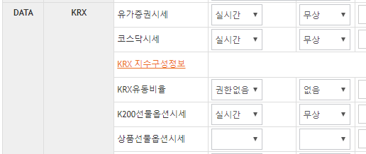
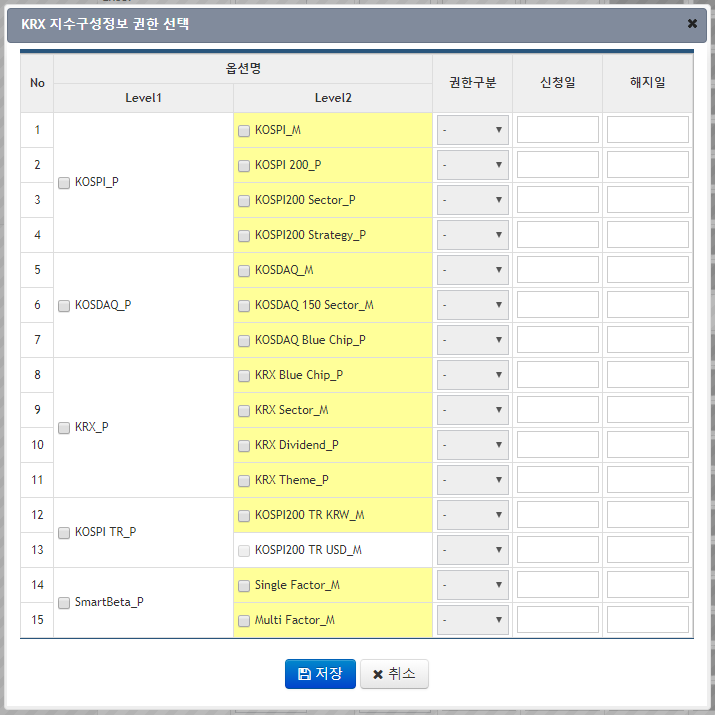
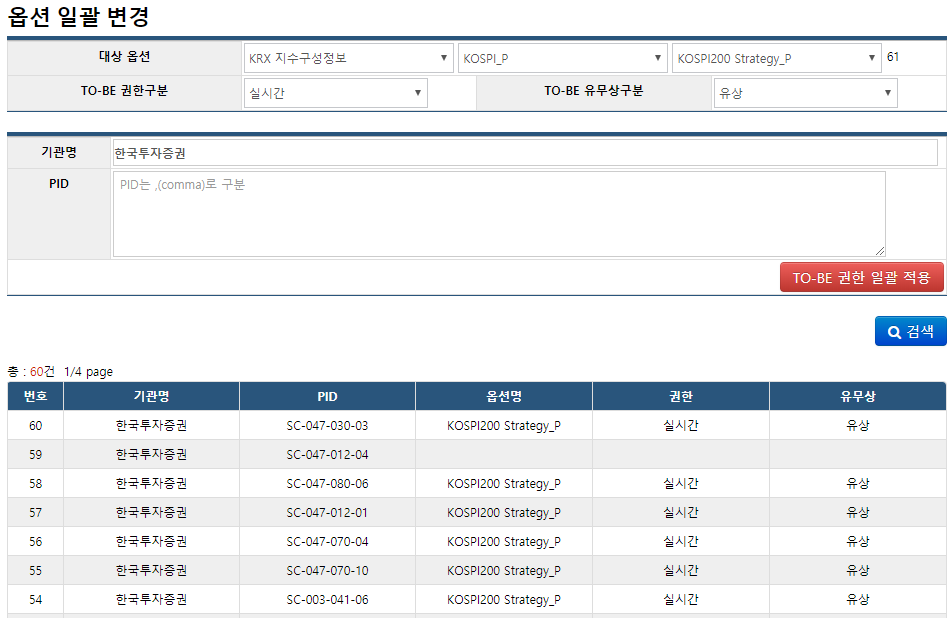

## KRX지수권한 _ KRX지수구성이란?


### 개요
- 기본적으로 CRM을 통해 사용자에게 부여하는 권한옵션 중에 한 종류

- 보통 특정 고객(PID)을 대상으로 부여하기 보단 _특정 고객사_ 전체를 대상으로 부여한다.
	- 때문에 권한 신규 부여/삭제를 위한 '일괄 변경' 요청이 잦다. (From 정보업무팀, 대체로 송수현 과장)

- 거래소의 관심 대상이기 때문에, 비정기적인 관리 요청이 자주 들어오며 필수적으로 응대해야 한다.
	- (예) 고객에게 권한을 일괄로 부여 또는 삭제해달라는 요청
	- (예) 보고자료를 만들기 위한 통계 자료 또는 기능을 제공해달라는 요청


### 권한 부여/삭제 관리 (For CHECK고객)
- 다른 권한옵션들과 마찬가지로 `고객정보관리 - 권한옵션` 탭에서 변경할 수 있다.
- 다른 권한옵션보다 1 Depth 더 깊은 단계에서 세부 권한이 정의된다.

- PID별로 수정할 때는 아래와 같이 한다.
	- `고객정보관리` - PID 선택하여 상품 정보 보기 - `권한옵션` 탭 - `수정` 버튼 - `선택/옵션 등록&수정` 모달팝업 - `KRX 지수구성정보` 링크 클릭

	
	
	- `KRX 지수구성정보 권한 선택` 모달팝업 - 부여하고자 하는 권한(Level2)의 체크박스를 체크 또는 비체크 상태로 만들고 `저장` 버튼 클릭
		> `KRX지수구성` 옵션의 변경사항은 이 단계에서 저장된다.
	
	
	
	> Level2 에서 노란색 배경으로 표시된 권한들이 현재 활성화 되어 있는, 즉 사용 가능한 권한들이다. (2019년 2월 현재 `KOSPI200 TR USD_M` 권한을 제외하고 모두 열려있다.)
	

- 고객사 단위로 수정할 때는 아래와 같이 한다.
	1. (예) '한국투자증권' 고객사에 KRX지수구성 권한 중 __KOSPI__ 패키지의 __KOSPI200전략__ 권한을 부여해 달라는 요청이 들어왔다고 가정하면,

	2. CRM에 __관리자__ 로 로그인한 뒤, (관리자ID: test)
	3. `고객정보` - `옵션일괄변경(Admin)` 메뉴 클릭
		> 이 기능은 일반 CRM사용자에겐 오픈하지 않는 것이 좋다. 권한옵션과 관련하여 치명적인 오작동이나 부작용이 발생할 경우 수습하기가 어려울 것이다.

	4. 권한옵션 검색 조건을 설정한 뒤 `검색` 버튼 클릭
		> 반드시 `검색`을 먼저 수행한다!

		> `TO-BE 권한 일괄 적용`을 먼저 눌렀다간 대참사가 일어날 수 있으니 주의한다!!
		
		


		대상 옵션 | ... | ... |
		---- | ---- | ---- |
		KRX지수구성정보 | KOSPI_P | KOSPI200 Strategy_P |
		
		TO-BE 권한구분 | TO-BE 유무상구분 |
		---- | ---- |
		실시간 | 유상 |
		
		**기관명** |
		---- |
		 **한국투자증권**
		 

	5. 검색 결과를 먼저 보면서 변경 대상이 정상적으로 잘 검색되었는지 확인한다.
	
	6. 대상 확인이 끝나면 `TO-BE 권한 일괄 적용` 버튼 클릭하여 변경 적용 - 변경 완료 후 바로 결과가 표시되므로 잘 반영되었나 확인한다.

	7. 끝.
		


### 권한 부여/삭제 기능 자체의 관리 (For CRM사용자)

- 신규 권한의 Open, 관리 화면 변경, 기능 수정 등의 관련된 모든 유지보수 개발작업은 **BI C&S**에 의뢰한다.

- (예)를 들어, 2019년 2월 현재까지, 아직 비활성 상태로 남아있는 `KOSPI200 TR USD_M` 권한도 사용할 수 있게 해달라고 연락이 왔다면(From 정보업무팀), **BI C&S** 에 열어달라고 요청하면 된다.


### KRX지수구성 정보 관련 통계

- 2018년 12월에 정보업무팀 황도연 차석 요청으로 추가된 기능으로,
- 거래소에서 요청하는 반기 보고서 작성용으로 사용된다.

- CRM 의 `통계정보` - `지수구성종목통계`의 하위메뉴에서 이용한다.

- 증권종합DB(HDB)의 화면 조회 로그를 이용하여 분석하기 때문에, 대상 기간이 길수록 결과가 나오는데 시간이 오래 걸린다.

- 관련 소스를 찾는 방법은 다음과 같다.
	> 유사한 통계기능을 추가로 개발해야 한다면 아래 소스들을 참고하여 비슷한 구성으로 개발하면 된다.

	- Controller
		- StatsMngContoller.java
			> KRX지수구성통계 뿐만 아니라 다른 통계 기능메뉴의 Request들도 처리하는 컨트롤러
			
			```
			if ("Kidx".equals(prefixStat)) {
				...
			}
			```

	- Service
		- StatsService.java
			
			```
			public List<ZValue> kidxCustmrList(ZValue vo) {
				...
			}
			```
			
			```
			public List<ZValue> kidxViewCountList(ZValue vo) {
				...
			}
			```
			
	- DAO
		- StatsDAO.java
			> KRX지수구성 권한명 정보는 여기서
			
		- StatsHdbDAO.java
			> 실제 로그 데이터 및 통계 결과는 여기서
	- SQL
		- Stats_SQL_mysql.xml
		- StatsHdb_SQL_altibase.xml

	- View(JSP)
		- KidxCustmrList.jsp
		- KidxViewCountList.jsp
	


### End of doc.
