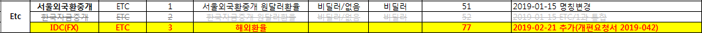

### 작업 개요

신규 권한을 추가하여 CRM을 통해 권한 부여 및 관리가 가능하도록 지원한다.

---

### 요청 원문

- 요청일: 2019-02-12 (화)
- 요청자: 홍석진
- 원문:
```
안녕하세요.
환율제공업체인 IDC와의 계약이 1000명 제한으로 변경예정인 관계로 IDC 데이터에 대한 권한처리를 진행하고자 합니다.

1. IDC 관련 CRM 권한 부여
 - 현재 조회고객 리스트 참고하여 '권한있음' '무상' 부여
 - 추후 고객권한이 추가될 경우에 1000명까지 무상, 1001명 부터는 유상으로 셋팅되도록 함(자동처리 가능한지 확인)
 - 신규고객의 경우, 기본옵션은 '권한없음'이나, 영업직원판단하에 '선물환계산기'등의 콘텐츠가 필요할 경우, 권한 부여함

2. 대상화면 및 종목검색창 권한처리
 - 권한 없을 경우, 콤보 삭제
 - 종목검색창에서 IDC 제외
 - 엑셀, 차트, 관심종목 등 권한처리 가능한지 검토 필요

3. 목표일
 - 올해 7월 재계약 예정
 - 계약 전 사전자료로 의미있게 갖고자 3개월 전 권한처리 요청
 - 7월까지 권한추가 요청하는 고객들에 대해 권한부여
 - 이행목표일 : 3월 말

자세한 내용은 개편요청서 참고 부탁드립니다.
감사합니다.
```

---

### **작업 내용**

CRM에서 해주어야 할 일은  
- 새로운 권한 항목의 추가
- 추가된 권한에 대한 권한 보유자수 관리  
의 두 가지이다.

---


### **새로운 권한 항목 추가하기**
1. 권한 추가
    - 엑셀을 참고하여 새 코드를 딴다.
        

    - `COM071` 공통코드에 추가한다. 
        - 기존 ETC권한이 사용하던 '非딜러/딜러' 구분이 아닌, '**권한없음/권한있음**' 구분을 사용해야 한다.
        - 때문에 `ETC권한_IDC` 항목을 추가로 생성하여 새 코드를 만든다.

    - `COM072` 공통코드에 추가한다.
        - ETC(004)에 하위코드등록

            코드정보 | |
            ---- | ----  
            코드 | 00403  
            코드명 | IDC(FX)  
            코드설명 | IDC(FX) 해외환율, 2019-02-21 추가  
            정렬순서 | 3  

        - IDC(FX)(00403)에 하위코드등록

            코드정보 | |
            ---- | ----  
            코드 | 77  
            코드명 | 해외환율
            코드설명 | IDC(FX) 해외환율, 2019-02-21 추가  
            정렬순서 | 1
            옵션1 | **005** (COM071의 upperCode 정보, 중요)
            옵션2 | **ETC** &rarr; AUTH_NM @CUST_OPTION_MAST
            옵션3 | **3**  &rarr; OPT_NO @CUST_OPTION_MAST
            옵션4 | N

2. 권한 관리화면 수정
    - `MngUpdateOptionPopup.jsp`
        ```
        <util:commonCodeList groupCode="COM071" upperCode="005" listName="etcIdcAuthList"/> <!-- 20190221 jwahn -->

        ...

        <%-- 20190221 jwahn --%>
        <c:when test="${opt.option1 eq '005' and opt.code eq '77'}"> <%-- IDC(FX) 해외환율--%>
            <cntrl:FormSelect itmes="${etcIdcAuthList}" val="${opt.authorSeCd}" name="optList[${opt.code}].authorSeCd" title="권한" allSelOff="false" selectionLabel=" "/>
        </c:when>
        ```
    - `GoodsOptionBundleChange.jsp`
        ```

        ```


3. 새로 추가한 **ETC - IDC(FX) - 해외환율** 권한의 설정이 정확하게 입력 및 수정되는지 확인

---

### **권한 보유자수 관리 기능 추가**

1. **ETC - IDC(FX) - 해외환율** 권한의 설정 변경 시 이벤트 처리 함수 추가
    - `MngUpdateOptionPopup.jsp`
        ```
        //20190221 ETC-IDC(FX)-해외환율 권한 보유 고객수에 따른 유무상구분 세팅
        function setOpt77() {
            var val = $("select#optList\\[77\\]\\.authorSeCd").val();
            if(val == '502') {
                $.ajax({
                    url: "/bos/crm/goods/getOptionNo77NotPaidCount.json", //현재 옵션 보유 고객수
                    data: {}, 
                    success: function(res) {
                        //결과에 따라 유무상 구분 자동 세팅 및 변경 불가
                        //console.log(res);
                        if(res.result.count < 1000) {
                            var available = 1000-res.result.count;
                            alert("IDC(FX) 해외환율 권한을 무상 사용 가능하여 무상으로 자동 설정됩니다.\r\n[잔여 가능 수량: "+available+"]");
                            $("select#optList\\[77\\]\\.cmgrSeCd").val("003"); //무상
                        } else {
                            alert("IDC(FX) 해외환율 권한의 무상 사용자 수가 초과하여 유상으로 자동 설정됩니다.");
                            $("select#optList\\[77\\]\\.cmgrSeCd").val("002"); //유상
                        }
                    }
                });
            } else {
                $("select#optList\\[77\\]\\.cmgrSeCd").val("");
            }
        }

        $(document).ready(function () {
            //20190221 ETC-IDC(FX)-해외환율 권한 무상 보유 고객수에 따른 유무상구분 변경 이벤트 처리
            $("select#optList\\[77\\]\\.authorSeCd").change(setOpt77);
            ...
        }
        ```
2. 현재 옵션을 보유하고 있는 고객수를 확인할 수 있는 처리 로직을 컨트롤러, 서비스, DAO 및 xml에 추가
    - `GoodsScrnController.java`
        ```
        @RequestMapping("/bos/crm/goods/getOptionNo77NotPaidCount.json")
        public @ResponseBody ZValue getOptionNo77NotPaidCount(ZValueParam zparam, ModelMap model) {
            ...
        }
        ```

    - `GoodsScrnService.java`
    - `GoodsDAO.java`
    - `Goods_SQL_mysql.xml`
        ```
        <select id="getOptionNo77NotPaidCount" parameterType="ZValue" resultType="ZValue">
                select count(*) as COUNT
                from
                (select * from TN_GOODS_OPTIONS where GOODS_OPTION_CD=77 and AUTHOR_SE_CD='502' and CMGR_SE_CD='003') o left outer join
                (select * from TN_GOODS where CNTRCT_STT_CD='001') g on o.GOODS_SQ=g.GOODS_SQ
                where g.GOODS_SQ is not null
        </select>
        ```

3. 정상동작 여부 확인

---

코드 변경 작업이 모두 완료되면 운영 crm에 이행한다.

개편요청서 상에 약 500여개의 PID에 대해서 권한의 일괄 부여를 요청하는 내용이 있으므로, '옵션일괄변경(Admin)' 기능을 이용하여 새로 만든 권한을 부여해준다.

---

끝.

    
