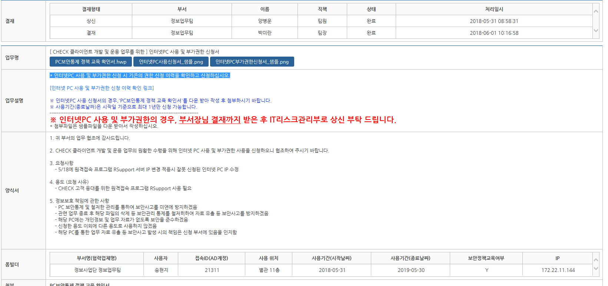

## CHECK 고객 원격지원

> 미리 RSupport 사용 신청을 위한 보안 관련 선행 작업이 되어 있어야 하며,  
> RSupport 프로그램을 다운 받아 설치해 놓아야 한다.

### [보안 선행 작업]
1. 나누미에서 - CMS 접속 - 보안업무 - 인터넷pc 사용 및 부가권한 신청서 - 인터넷 pc 프로그램 사용신청서 작성
    

2. 팀장 결재까지 상신
    > ※ IT리스크팀 담당자: 이루리 대리

### [RSupport 프로그램 설치]

3. RSupport 프로그램을 설치한 뒤 실행한다.
    - Download URL: <a href="">https://www.rsupport.com/ko-kr/resources/download/product-program/</a>
    - 대상: 리모트콜 6.0 Windows용 통합 Agent 설치파일

4. RSupport에 로그인한다.

    ID | PW |
    ---- | ---- |
    check1 ~ check9 | koscom@1

5. 고객에게 원격지원 프로그램을 실행 요청한다.
    - "고객님, 체크가 활성화된 상태에서 <strong>F4</strong>를 눌러주세요."  
    - "고객님, 체크 화면의 좌측 상단 화면번호/키워드 검색란에 9028을 입력해 주세요."

6. 설치된 프로그램을 통해 고객 화면에 접속하여 오류 상황 등을 확인해 볼 수 있다.

> RSupport 사용법을 잘 모르겠으면 체크 클라이언트 담당자(송현지, 최대한 사원)에게 문의

끝.
