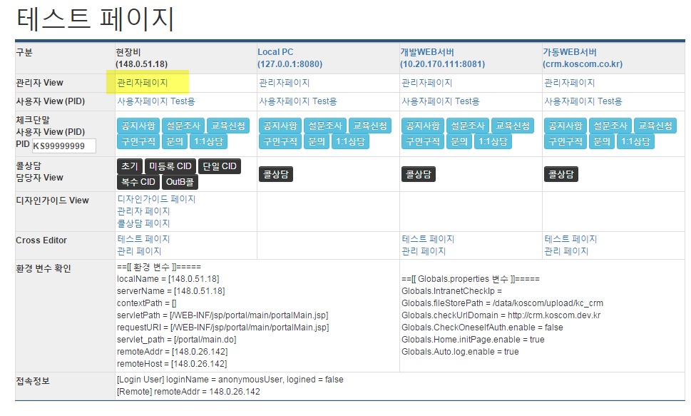

### 로컬(Local) 환경에서 crm 접속하기

- 접속 주소:
    - 업무PC: http://127.0.0.1:8080/bos/main/main.do
    - 인터넷PC: 접속 불가

---

### 개발(Dev) 환경에서 crm 접속하기

- 접속 주소:
    - 업무PC: http://148.0.51.18:8081
    - 인터넷PC: http://crmt.koscom.co.kr/  **현장비** 컬럼의 **관리자페이지** 링크 클릭
        > 우리 사내 직원들은 별도 설정 없이도 인터넷PC 에서 개발crm에 접속 가능하므로, 운영 이행 전 테스트가 필요할 때는 이곳에서 먼저 테스트하도록 유도한다.

    

---

### 운영(Opr) 환경에서 crm 접속하기

- 접속 주소:
    - 업무PC: 접속 불가
    - 인터넷PC: http://crm.koscom.co.kr/
