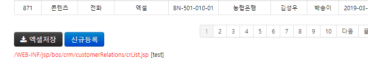
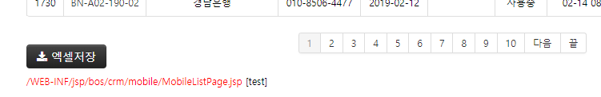

# 소스 찾아가기

사실 모든 정보는 소스에 있으며, 어떤 작업을 해야할 때 수정 대상이 되는 소스만 잘 찾아갈 수 있다면 이런 허접한 매뉴얼은 없는게 나을 수도 있다. :-)

각 기능과 관련된 소스코드 찾아가는 기본적인 방법과 응용 방법을 간략하게 기록해 본다.

---

## 가장 기본적인 접근 방법

1. crm에 관리자ID 'test'로 로그인을 하면, 모든 메뉴의 화면 좌측 하단에 빨간색 글씨로 다음과 같이 jsp 파일의 이름과 경로가 나타난다. 이 jsp 파일명은 모든 **소스 찾기의 기본**이 된다.

    - (예) **고객정보 - 고객자료관리 - 목록 및 조회** 메뉴
        
        > **/WEB-INF/jsp/bos/crm/customerRelations/crList.jsp**

    - (또다른 예) **모바일관리 - 서비스관리** 메뉴
        
        > **/WEB-INF/jsp/bos/crm/mobile/MobileListPage.jsp**

2. 

## 메뉴

- **고객정보**
    - **신규등록**
    - **고객정보관리**
        - **고객정보관리**
        - **옵션만료고객조회**
        - **옵션일괄변경(Admin)**
    - **기관및담당자관리**
    - **사용자관리**
    - **고객자료관리**
    - **요구사항처리**
- **모바일관리**
    - **서비스관리**
    - **현재 접속자**
    - **일별 접속자**
    - **문자 알림 관리**
- **공지관리**
    - **CHECK공지**
    - **원격명령**
    - **팝업관리**
    - **CHECK포스트잇**
- **설문조사**
    - **지난설문**
        - **체크오픈기념(160425)**
        - **채권4사평가(161114)**
        - **신년금융캘린더(2019)**
        - **새해자본시장전망(2019)**
    - **FOMC금리POLL**
    - **한국은행금리POLL**
    - **경품수령자**
    - **고객의견**
    - **설문조사 당첨자 정보**

- **게시판**
    - **공지사항**
    - **교육관리**
    - **구인구직**
    - **고객용(화면#1000)**
    - **CHECK다운로드**

- **통계정보**
    - **화면통계**
    - **기능통계**
    - **종목통계**
    - **뉴스원통계**
    - **고객통계**
    - **월간통계**
    - **System(접속)**
    - **지수구성종목통계**

- **관리자기능**
    - **담당자관리**
        - **담당자 정보관리**
        - **그룹 권한관리**
    - **코드관리**
    - **게시판관리**
    - **메뉴관리**
        - **관리자 메뉴관리**
        - **사용자 메뉴관리**
    - **콜수신관리**
    - **HDB조회:데이터**
    - **HDB조회:마스터**
    - **마이그레이션/동기화**
    - **테스트보드**
    - **주기작업**
        - **해지 1년 경과 고객**
        - **기타 개인 정보**
        - **그외 기능 및 보고서**
- **MyPage**
    - **내 정보**
- **기타**
    - **고객 콜상담** (버튼)
    - **Auto** (체크박스)
