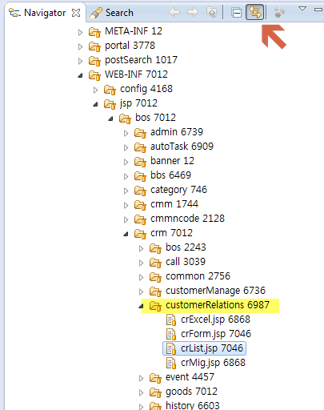

# 소스코드 찾아가기

사실 모든 정보는 소스에 있으며, 어떤 작업을 해야할 때 수정 대상이 되는 소스만 잘 찾아갈 수 있다면 이런 허접한 매뉴얼은 없는게 나을 수도 있다. :-)

각 기능과 관련된 소스코드를 찾아가는 기본적인 방법과 응용 방법을 간략하게 기록해 본다.

---

## jsp 파일명으로 추측 가능한 **공통 명명 규칙**으로 찾기

1. crm에 관리자ID 'test'로 로그인을 하면, 모든 메뉴의 화면 **좌측 하단에 빨간색 글씨**로 다음과 같이 jsp 파일의 이름과 경로가 나타난다. 이 jsp 파일명은 모든 **소스 찾기의 기본**이 된다.

    - (예) **고객정보 - 고객자료관리 - 목록 및 조회** 메뉴
        
        > 현재 화면의 jsp: **/WEB-INF/jsp/bos/crm/customerRelations/crList.jsp**

    - (또다른 예) **모바일관리 - 서비스관리** 메뉴
        
        > 현재 화면의 jsp: **/WEB-INF/jsp/bos/crm/mobile/MobileListPage.jsp**

2. 첫번째 예시인 'crList.jsp'를 가지고 관련 소스를 찾아가 보자.
    1. eclipse - navigator 창에서 koscom_crm 프로젝트를 선택한 뒤 `ctrl + shift + r` 을 누르자. (== Open Resource 기능)
    2. 검색할 item 이름으로 `crList`를 입력한 뒤, Matching items의 jsp를 open한다.  
        
    3. navigator에 "Link with editor" 설정이 되어 있다면(*양방향 화살표 표시*) crList.jsp 파일의 위치가 아래와 같이 보일 것이다.  
        
    4. 그리고 이 결과를 통해 몇 가지 추측이 가능하다.
        - crList.jsp가 포함되어 있는 폴더명 "customerRelations"를 보건대, '고객자료관리'는 cr, 즉 `customerRelations`라는 공통적인 명명 규칙을 가지고 있을 것 같다는 점.
        - 목록 조회는 crList.jsp, 신규 입력은 crForm.jsp, 엑셀 저장은 crExcel.jsp, 마이그레이션은 crMig.jsp 화면이 담당하고 있을 것 같다는 점.

3. 이제 위에서 추측한 내용을 바탕으로 컨트롤러를 찾아보자.
    1. eclipse - navigator 창에서 koscom_crm 프로젝트를 선택한 뒤 `ctrl + shift + r` 을 또 누른다.
    2. item 이름으로 *customerRelations*를 입력해본다.
        
    3. 컨트롤러, 서비스, DAO 등 연관된 소스를 모두 찾을 수 있다.

> crm의 많은 기능이 이와 같이 jsp 이름을 바탕으로 찾아갈 수 있게 구현되어 있다.

---

## 호출되는 request URL로 찾기

1. 이번엔 '**관리자기능 - 임시기능 모음**'에 정의된 기능들의 위치를 찾아보자. 먼저 jsp 파일명을 확인한 뒤 이를 오픈한다.
    - **/WEB-INF/jsp/bos/crm/migration/TempFunctionList.jsp**

2. **TempFunctionList.jsp** 에 정의된 34번째 기능 '**tempFunction34: 고객정보 항목변경 및 일괄 업데이트**'의 컨트롤러를 찾고 싶다고 해보자.
    - '공통 명명 규칙'으로 찾을 수 있을까 하여 **TempFunctionList.jsp** 가 포함된 'migration'을 키워드로 MigrationController.java 를 열어봤지만, 여기에는 해당 기능에 대한 정의가 존재하지 않는다.
    - 'migration'이 아니면 jsp 파일명에 포함된 'tempfunction'이라는 키워드로 검색해 볼 수도 있지만 지금은 이렇게는 검색하지 않았다고 가정하자.

3. MigrationController 에선 찾지 못한 34번 기능의 request URL을 **koscom_crm** 프로젝트 내에서 검색해본다.
    ```
    var url = "/bos/crm/ext/tempFunction/tempFunction34.json";
    ```
    - navigator에서 koscom_crm 프로젝트를 선택한 후 `crtl + h`를 입력하여 검색창을 연다.
    - **File Search** 탭에서 'tempFunction34.json'를 검색한다.
        
    - 검색 결과, 아래와 같이 1건이 검색되었다.
        
        - tempFunction34.json request를 처리하는 컨트롤러는 TempFunctionContoller.java 에 정의되어 있는 것을 찾았다.
    

---

## 예외적인 케이스
- **묵시적으로 request URL을 처리하는 경우**
    - Spring FW 기본 스타일이 아닌 unp 스타일(*최초 개발 업체*)을 따르고 있는 **게시판** 등의 경우 request URL 만으로는 관련 컨트롤러와 서비스 로직 소스코드 등을 찾기 어렵다. 이러한 경우는 좀 예외적이긴 하지만 종종 필요하므로 알아두어야 한다.
        - (예) `게시판 - 공지사항`
            1. jsp 파일명: `/WEB-INF/jsp/bos/bbs/PG0009/List.jsp` &rarr; 검색 결과 없음
            2. request URL: `/bos/bbs/B0000012/list.do` &rarr; 검색 결과 없음
            3. part of request URL: `B0000012`
            
                > `CheckTermController.java`는 CHECK client의 #1000 화면에서 조회할 때의 request를 처리한다. (Term=Terminal의 의미)

                > `OptionalBBSManageService.java`와 `FnwBBSManageServiceImple.java`는 unp 스타일의 기본 게시판 관련 서비스 처리 로직이 구현되어 있다. crm 게시판 관련 많은 부분이 하드코딩 되어 있고, 예외적인 처리가 많기 때문에 상세 내용은 코드를 자세히 들여다보는 수밖에 없다.
            
- **request URL의 일부분이 param 처리된 경우**
    - 몇몇 request URL의 경우, URL의 일부분을 **{parameter}** 로 정의하여 처리하도록 되어 있어서 `ctrl + h` 로 바로 검색해서는 결과가 나오지 않는다.
    - 이럴 땐 request URL의 일부분을 java에 검색하여 관련 컨트롤러를 찾을 수 있다.
    - (예) **화면통계 - 조회순위**
        1. jsp 파일명: `/WEB-INF/jsp/bos/crm/stats/PageTotSimpleList.jsp` &rarr; 검색 결과 없음
        2. request URL: `/bos/crm/stats/PageTotSimpleList/list.do` &rarr; 검색 결과 없음
        3. part of request URL: `/bos/crm/stats/` &rarr; **`StatsMngController.java`**
        ```
        @RequestMapping("/bos/crm/stats/{statClass}/list.do")
        ```
        > `PageTotSimpleList` 부분이 **{statClass}** 파라미터로 처리되었음을 알 수 있다.

    - (또다른 예) **설문조사 당첨자 정보 입력 팝업**
        > `공지관리 - CHECK공지` 에 등록된 인터넷공지 중 한 가지 유형이다.
        1. jsp 파일명: URL 만으로는 파악하기 어려움 (*request URL을 통해 컨트롤러를 찾으면 return jsp도 알 수 있다.*)
        2. request URL: `http://crm.koscom.co.kr/bos/crm/ext/event/reward/form.do?...` &rarr; 검색 결과 없음
        3. part of request URL: `/bos/crm/ext/event/reward/` &rarr; **`EventRewardController.java`**
        ```
        @RequestMapping("/bos/crm/ext/event/reward/{type}.do")
        ```
        > `form` 부분이 **{type}** 파라미터로 처리되었다.

- 이도저도 아니어서 잘 모르겠을 때는 그냥 화면 내에서 보이는 keyword로 검색해서 찾는 수밖에...

---
