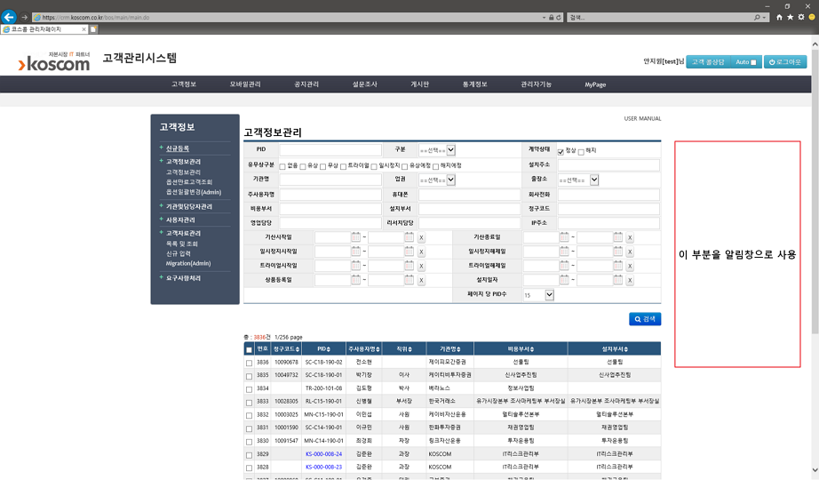
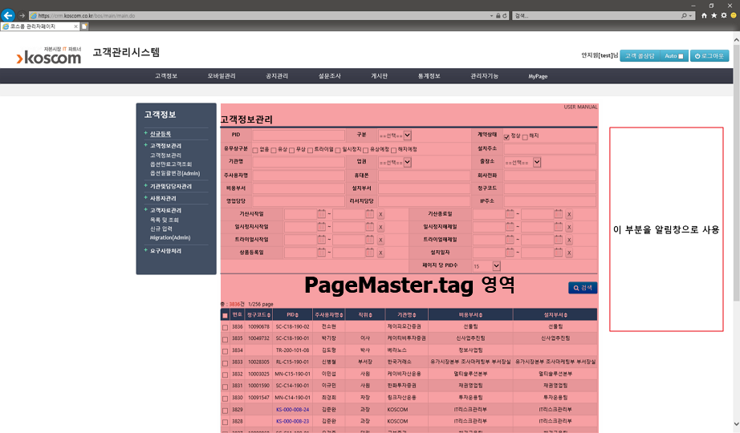

### 일시정지 기간 알림

- 요청 원문
```
- CHECK 일시정지단말에 대해 일정기간이 지나면 영업AM의 CRM 로그인시 알람전달 요청(알람이 아니라도, 영업AM 이 알수있도록 알려주는 기능이 필요)
* 일시정지 : 일시정지 시작일 후 7개월차, 19개월차에 알림

- 영업AM 별로 구분하여 표시
```


CRM 화면 양 옆에 여백이 좀 있으니, 오른쪽 여백에 '알림창(`<div id='alarm'/>`)' 부분을 만들어서 거기 띄워주면 괜찮을 것 같다.




crm의 거의 모든 화면에 공통적으로 적용되고 있는 `PageMaster.tag` 에서 작업...하면 되겠지 했는데,
PageMaster.tag는 메뉴를 제외한 영역에만 적용되는 것이었다...




그럼 어느 소스를 고쳐야 하나..

저 중앙 데이터 영역이 iframe name="contentFrame"으로 정의되어 있으므로, 이러한 <iframe> 태그를 가지고 있는 jsp를 찾으면 될 것 같다.

&rarr; WEB-INF/jsp/bos/main/bosMain.jsp 를 찾았다.

알림창과 여닫기 버튼을 아래와 같이 만들어 넣기 시작했다.
데이터를 채워넣는 것은 다음에...

```
<%-- 20190321 --%>
<div id="user_alarm" style="background-color:#1c1c1c;position:fixed;right:100px;/* font-family:Malgun gothic; */font-size:12px;color:white;padding:10px;border-radius:5px;">
	<div id="ua_menu" style="width:200px;height:20px;border-bottom:solid white 1px;">
<!-- 					<span class="ua_maximize" style="float:right;"><span class="glyphicon glyphicon-menu-down"></span></span> -->
<!-- 					<span style="float:right;">&nbsp;&nbsp;</span> -->
		<span class="ua_minimize down" style="float:right;cursor:pointer;"><span class="glyphicon glyphicon-menu-up"></span></span>
	</div>
	<div id="ua_title1" style="height:20px;border-bottom:solid white 1px;"><span style="font-size:13px;font-weight:bold;">일시정지 기간경과 단말</span></div>
	<div id="ua_summary1" style="height:20px;border-bottom:solid white 1px;">△6개월: 2건, △18개월: 2건</div>
	<div id="ua_cont1_paused" style="margin-top:4px;max-height:100px;overflow-x:auto;overflow-y:auto;letter-spacing:1px;overflow-y:auto;">
		<span class="ua_pid">KS-999-999-99</span> (<span class="ua_overdate 6m" style="font-size:13px;color:#facc2e;">6m 2d</span>)<br/>
		<span class="ua_pid">KS-999-999-99</span> (<span class="ua_overdate 6m" style="font-size:13px;color:#facc2e;">6m 2d</span>)<br/>
		<span class="ua_pid">SC-A12-001-04</span> (<span class="ua_overdate 6m" style="font-size:13px;color:#facc2e;">6m 5d</span>)<br/>
		<span class="ua_pid">SC-A12-001-04</span> (<span class="ua_overdate 6m" style="font-size:13px;color:#facc2e;">6m 5d</span>)<br/>
		<span class="ua_pid">SC-123-456-78</span> (<span class="ua_overdate 18m" style="font-size:13px;color:#fe2e2e;">19m 11d</span>)<br/>
		<span class="ua_pid">SC-123-456-78</span> (<span class="ua_overdate 18m" style="font-size:13px;color:#fe2e2e;">19m 11d</span>)<br/>
		<span class="ua_pid">BA-000-111-22</span> (<span class="ua_overdate 18m" style="font-size:13px;color:#fe2e2e;">20m 3d</span>)<br/>
		<span class="ua_pid">BA-000-111-22</span> (<span class="ua_overdate 18m" style="font-size:13px;color:#fe2e2e;">20m 3d</span>)<br/>
	</div>
	<script>
		$(".ua_minimize").click(function () {
			if($(this).hasClass("down")) {
				$("#ua_title1,#ua_cont1_paused,#ua_summary1").hide();
				$("#ua_menu").css("width","12px");
				$(this).removeClass("down").addClass("up");
				$(".glyphicon-menu-up").removeClass("glyphicon-menu-up").addClass("glyphicon-menu-down");
			} else if($(this).hasClass("up")) {
				$("#ua_title1,#ua_cont1_paused,#ua_summary1").show();
				$("#ua_menu").css("width","200px");
				$(this).removeClass("up").addClass("down");
				$(".glyphicon-menu-down").removeClass("glyphicon-menu-down").addClass("glyphicon-menu-up");
			}
		});
	</script>
</div>
```