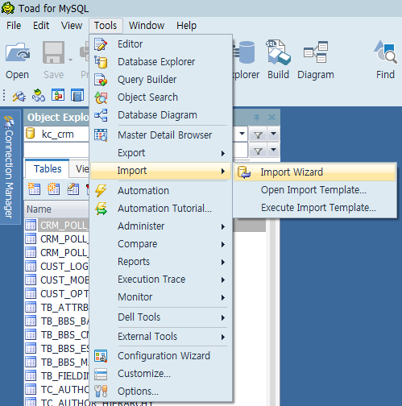
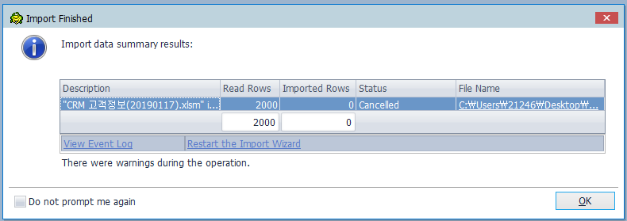
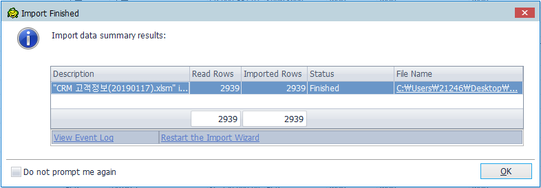

# 주사용자 정보 변경

### 요청 원문
- 요청자: 황도연
- 요청일: 2019-01-18
    ```
    주 사용자 변경 기준
    - 변경 : 업무, 투자상품 -> 직무, 투자금융상품 항목 변경
    - 신규 : 업무 상대방
    * 자세한 사항은 첨부 참조 (CRM 고객정보(20190117).xlsm)
    ```


### 작업 개요
- 이 요구사항은 `crm` - `고객정보` - `고객정보관리` - 목록 중 **아무 사용자**나 클릭 - 화면 하단 _사용자정보_ 탭의 `주 사용자 정보`에서 디스플레이 되는 <u>사용자 상세 정보</u>의 항목을 변경하고 신규로 추가해 달라는 요청사항이다.

- 이 요구사항의 처리를 위해 해야 할 일은 다음과 같다.
    1. DB 테이블 수정: MySQL `TN_GOODS_USER` 테이블에 '업무상대방' 정보 저장을 위한 컬럼 추가
    2. 공통코드 수정: 사용자의 `업무, 투자상품` 정보를 관리하는 공통코드값 <u>변경</u>
    3. 공통코드 추가: 사용자의 `업무상대방` 정보를 관리하기 위한 공통코드값 <u>추가</u>
    4. 소스코드 변경 - 화면 및 사용자정의태그 수정: 사용자 정보를 조회, 입력하는 연관 화면 변경
    5. 소스코드 변경 - 기능 처리 로직 수정
    > 여기까지는 기능 변경, 아래는 데이터 변경
    6. 요구사항 엑셀 파일의 'CRM적용' sheet 내용 MySQL DB에 업로드  
        (toad의 import 기능을 이용한다.)
    7. 위의 임시 데이터를 이용하여 사용자 정보를 일괄 업데이트 하는 임시 기능 구현 및 실행

### 작업 내용 상세

1. DB 테이블 수정
    - `TN_GOODS_USER` 테이블에 `업무상대방` 정보를 저장하기 위해 `JOB_COUNTERPART_CDS` 컬럼을 추가한다.
    - 유사한 데이터를 저장하는 컬럼 `JOB_CDS`와 비슷하게 **varchar(100)**을 부여한다.  
        (코드 종류가 많지 않아 데이터 길이가 길지 않다.)
    ```
    alter table TN_GOODS_USER add column JOB_COUNTERPART_CDS varchar(100) after JOB_CDS;
    ```
    - 위 쿼리를 개발 및 운영WAS 환경의 shell 에서 직접 실행하여 변경된 내용을 반영한다.


2. 공통코드 수정
    > 코드명 `사용자_업무`는 `사용자_직무`로, `사용자_투자상품`은 `사용자_투자금융상품` 으로 변경해야 한다.
    1. `crm` - `관리자기능` - `코드관리` - `공통코드관리` 메뉴를 클릭한다.
    2. 검색 키워드 `'업무'`로 검색한다.
    3. 검색 결과 중 `코드ID명`에 '사용자_'라는 구분값이 있는 **COM052** 가 현재 사용 중인 `'업무'` 의 코드값이다.
    4. **COM052** 의 **`[ 관리 ]`** 를 클릭하면 하위 코드의 변경이 가능한 팝업 창이 열린다.
    5. 기존 정보들은 _비활성화_ 하고, 신규 코드를 추가한다.
        - 기존 코드 비활성화
            - _트레이더(001) ~ 백오피스(011), 기타(099)_ 코드들은 각각 클릭한 뒤 우측 상세 정보의 `코드사용여부*`에서 `미사용` 선택 후 `수정` 버튼 눌러서 저장

        - 신규 코드 등록
            - 좌측 코드 목록 중 최상단의 '`상세코드 관리`'를 선택한 뒤 우측 정보폼 하단의 '`하위코드등록`' 버튼 클릭
            - `코드`, `코드명`, `코드설명`, `정렬순서` 입력하고 '`등록저장`' 버튼 클릭
            - 추가할 각 코드에 대해 _**위 두 단계를 반복 시행**_
            
                코드 | 코드명/코드설명 | 정렬순서
                ---- | ---- | ----
                012 | 펀드매니저 | 12
                013 | 트레이더 | 14
                ... | | |
                022 | 기타 | 22
            
            > 여기서 `코드`값은 숫자로 부여되지만, 실제로는 `varchar(5)`를 사용하는 문자열임에 주의한다.  
            ( 시스템 상에서 `012` 코드는 숫자 12가 아니라 문자열 `012`로 처리됨 )
    6. **'COM052'** 코드 자체의 이름을 변경하기 위해, 위 3.의 검색 결과 중 `코드ID` 열에 있는 `COM052` 링크를 클릭한다.
        - `수정` 버튼을 클릭한다.
        - `코드ID명*`과 `코드ID설명*`을 **'사용자_업무'** 에서 **'사용자_직무'** 로 변경한 뒤 `저장` 버튼을 클릭하여 저장한다.
    7. '`투자상품`' 코드에 대한 변경 흐름은 위 1~6 '`업무`' 코드에 대한 변경 방식과 동일하며, 대상은 코드ID=`COM053` 이다.

        코드 | 코드명/코드설명 | 정렬순서
        ---- | ---- | ----
        009 | 국내주식/지수               | 9
        010 | 국내주식/지수관련파생       | 10
        ... | | 
        035 | 원자재파생                  | 35

    8. 추가해야 할 코드 양이 너무 많아서 일일이 손으로 넣기가 빡셀 땐 아래와 같은 쿼리를 이용하여 DB에 직접 삽입할 수 있다.
        ```
        insert into TC_CMMNCODE_DETAIL (CODE_NM, CODE_DC, USE_AT, CODE, CODE_ID, FRST_REGIST_PNTTM, FRST_REGISTER_ID, LAST_UPDT_PNTTM, LAST_UPDUSR_ID, UPPER_CODE, DEPTH, SORT_ORDR) values ('국내주식/지수','국내주식/지수','Y','009','COM053',NOW(),'test',NOW(),'test',0,1,9);

        ...
        ```
        > com052_insert_query.sql, com053_insert_query.sql 파일 참조  
        > 코드 구조가 더 복잡한 경우엔 위와 같은 단순 삽입문으로는 해결되지 않을 수도 있으므로 유의한다. 좀 귀찮더라도 일일히 Web UI 에서 손으로 입력하는 것이 나을 수 있다.

3. 공통코드 추가
    > `사용자_업무상대방` 라는 공통코드를 신규 추가할 것이다.
    1. `crm` - `관리자기능` - `공통코드관리` - 우측 하단 `'등록'` 버튼을 클릭한다.  
        분류코드명 | 코드ID명 | 코드ID설명 | 사용여부
        ---- | ---- | ---- | ----
        KOSCOM | 사용자_업무상대방 | 사용자_업무상대망 20190129 신규 생성 | Yes
        
        - **COM120** 으로 생성된 것을 확인한다. 이 `코드ID`는 개발과 운영이 동일하게 부여되어야 추후 관리가 용이하다.
        - 하위 코드를 등록한다.
            코드 | 코드명/코드설명 | 정렬순서
            ---- | ---- | ----
            001 | 금융회사 | 1
            002 | 금융 유관기관 | 2
            003 | 일반기업고객 | 3
            004 | 개인고객 | 4
            005 | 기타 | 5

4. 소스코드 변경 - 화면 및 사용자정의태그 수정
    - (1) `TabbedGoodsUserView.jsp`
        - 추가: 새 공통코드 `COM120`의 사용을 위해 추가  
            ```
            <util:commonCodeList groupCode="COM120" listName="jobCounterpartCdsList"/>
            ```
        - 추가: 새로 추가된 컬럼 `JOB_COUNTERPART_CDS` 의 정보를 표시하기 위해 추가   
            ```
			<tr>
				<hist:PopHistGoogs label="업무상대방" columnNm="jobCounterpartCds" colspan="3"><cntrl:ViewCheckboxs itmes="${jobCounterpartCdsList}" val="${result[0].jobCounterpartCds}"/></hist:PopHistGoogs>
            </tr>
            ```
            > PopHistGoogs.tag 는 사용자 정의 태그로, 정보 변경 히스토리를 출력하기 위한 처리를 포함하고 있다. 이 변경 히스토리는 다른 소스코드에서 추가 작업을 해줘야 정상적으로 보일 가능성이 높다. (이번엔 패스)

    - (2) `MngUpdateUserPopup.jsp`
        - 추가: 새 공통코드 `COM120`의 사용을 위해 추가  
            ```
            <util:commonCodeList groupCode="COM120" listName="jobCounterpartCdsList"/>
            ```
        - 변경: GoodsUserEditNew.tag 로 넘겨주는 인자를 하나 더 추가 (`jobCounterpartCdsList`)  
            ```
            <crm:GoodsUserEditNew classOn="true" goodsUser="${goodsUser}" jobCdsList="${jobCdsList}" invtGoodsCdsList="${invtGoodsCdsList}" jobCounterpartCdsList="${jobCounterpartCdsList}"/>
            ```

    - (3) `GoodsUserEditNew.tag`
        - 추가: 새 공통코드 `COM120`의 사용을 위해 추가  
        ```
        <%@ attribute name="jobCounterpartCdsList" required="true" type="Object" %>  
        <%--업무상대방 코드 테이블--%>
        ```
        - 추가: `업무상대방`의 정보를 수정하기 위한 checkbox 표시를 위해 추가
        ```
        <tr>
			<th>업무상대방</th>
			<td class="label_list" colspan="3">
				<cntrl:FormCheckboxes name="jobCounterpartCds" itmes="${jobCounterpartCdsList}" val="${goodsUser.jobCounterpartCds}" title="업무상대방" clazz="userInfo" readOnly="${readOnly}"/>
			</td>
		</tr>
        ```


5. 소스코드 변경 - 기능 처리 로직 수정
    - (1) `GoodsUser_SQL_mysql.xml`
        - 변경: 최초에 사용자 정보 삽입할 때 `업무상대방` 항목도 저장
        ```
        <insert id="insertGoodsUserNew" parameterType="ZValue">  
            ...
            , JOB_COUNTERPART_CDS
            ...
            , #{jobCounterpartCds}
            ...
        </insert>
        ```
        - 변경: 사용자 정보를 수정할 때 `업무상대방` 항목도 변경
        ```
        <update id="updateGoodsUserNew" parameterType="ZValue">  
            ...
            , JOB_COUNTERPART_CDS = #{jobCounterpartCds}
            ...
        </update>
        ```
        - 변경:
        ```
        <select id="checkUserUpdNew" parameterType="ZValue" resultType="int">  
            ...
			<choose>
				<when test="jobCounterpartCds == null or jobCounterpartCds == ''">
					AND (JOB_COUNTERPART_CDS is null OR JOB_COUNTERPART_CDS = '')
				</when>
				<otherwise>
					AND JOB_COUNTERPART_CDS = #{jobCounterpartCds}
				</otherwise>
			</choose>
            ...
        </select>
        ```

> 여기까지 작업하고 Local 환경에서 CRM을 구동하여 변경된 항목 및 새로 추가된 항목에 대한 입출력이 정상적으로 동작하는지 확인한다.

6. 요구사항 엑셀 파일의 'CRM적용' sheet 내용 MySQL DB에 업로드하기
    1. Toad 실행 - 상단 메뉴 중 Tools - Import - Import Wizard 클릭
        
    2. Next - Add File - CRM 고객정보(20190117).xlsm 선택
    3. Sheets 에서 'CRM적용'만 체크한 후, 데이터 로딩 상태를 보고 정상적이면 Next
    4. 불필요한 마지막 <NullColumn 9>는 `Remove` 하고 Next
    5. A Single New Table 선택  
        - Table Name : MIG_USER_INFO_RENEW
        - Column 별 Type 을 적당히 설정하고 Next
        (확실하지 않은 컬럼일수록 varchar 형에 넉넉한 길이로 해야 오류가 없을 확률이 높음)
    6. Import objects list: 에 업로드한 파일 녹색 체크 표시 떴으면 Next
    7. Import Data Now, Finish
    8. 결과 확인
        
        > 정상적으로 올라갔다면 데이터 행 수가 2,939건. 결과는 2,000건. 데이터 업로드 중에 오류가 있었던 것이므로 log를 확인해본다.
    9. 데이터 중 일부가 설정된 데이터형보다 길어서 문제가 발생하였던 것으로, 5. 단계에서 Column 별 Type 설정 시 varchar 길이를 더 넉넉하게 변경한 뒤 재업로드한다.
        
        > 2,939건 정상적으로 업로드 되었다.

7. 위의 임시 데이터를 이용하여 사용자 정보를 일괄 업데이트 하는 임시 기능 구현 및 실행
    1. 엑셀에 있는 데이터와 현재 DB 상의 데이터를 비교하여, 엑셀에 있는 데이터로 일괄로 변경 적용하는 기능을 구현할 것이다.
        - 이 기능의 사용은 일회성이므로, 임시 기능을 구현하는 쪽에 모으는 것이 편리하다.
        - 이러한 임시 기능의 구현은 TempFunctionList.jsp 로부터 시작한다.
    2. TempFunctionList.jsp 에 아래와 같이 신규 기능을 실행하기 위한 URL 호출 버튼을 추가한다.
        - `TempFunction34()`로 추가
    ```
    <tr>
        <td>34</td>
        <td>2019-02-07</td>
        <td>tempFunction34: 고객정보 항목변경 및 일괄 업데이트</td>
        ...
        <td><a href="javascript:tempFunction34();" class="btn btn-xs btn-danger">실행</a></td>
    </tr>
    ```
    > '실행' 버튼을 누르면 `function tempFunction34()`가 실행되고, 이 함수는 그 내부의 __url__ 을 정상적으로 실행할 수 있는 구조이기만 하면 된다.

    3. `TempFunctionController.java, TempFunctionService.java` 에 실제 처리 로직을 구현할 예정이지만, 일단 원활한 테스트를 위해 `TempFunctionTest.java` 에서 먼저 junit 테스트 방식으로 로직을 선 구현한다. (이후 이 내용을 `TempFunctionService.java` 로 옮길 것이다.)

    4. `TempFunctionTest.java` 에 아래와 같은 소스코드를 작성한 뒤, `Alt + Shift + X, T` 로 실행하여 정상 동작하는지 확인한다.
    ```
    public void tempFunction34() {
        dao.clearDataTempFunc34();
        List<ZValue> newData = dao.getSourceDataTempFunc34();
        for(ZValue newVal : newData) {
            ...
        }
    }

    private void compareAndUpdateDataTempFunc34(int convertType, ZValue oldVal, ZValue newVal) throws Exception {
        ...
    }
    ```

    5. 정상동작이 확인되면 `TempFunctionService.java` 에 동일한 함수를 작성하고, URL로 호출 가능하도록 `TempFunctionController.java`에 `@RequestMapping("...")`부분도 작성한다.
    ```
    @RequestMapping(value="/bos/crm/ext/tempFunction/tempFunction34.json", method=RequestMethod.GET)
    @ResponseBody
    public ResponseEntity<JSONObject> tempFunction34(ZValueParam zparam, HttpServletResponse response) {
        JSONObject result = new JSONObject();
        try {
            srvTemp.tempFunction34();
        } catch (Exception e) {
            ...
        }
        return new ResponseEntity<JSONObject>(result, HttpStatus.OK); 
    }	
    ```
    
    6. `관리자기능 - 테스트보드 - 임시기능 모음 - No.34 tempFunction34: ...` 의 `실행` 버튼을 클릭하여 작업한 기능을 실행하면 데이터 일괄 변경이 적용된다.

    

### End of Doc.
